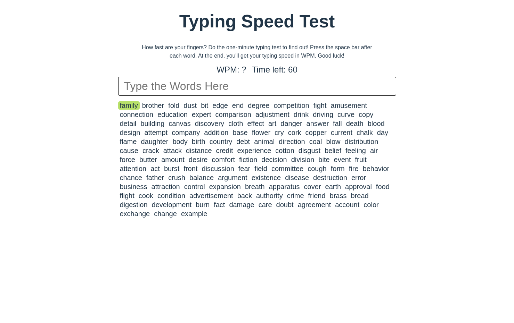

# [Typing Test Game](https://benny-typing-test.netlify.app/)



#### Top Technologies

[](#) [](#)

This game was built with React, TypeScript, and CSS.

## Installation

1. Download repository
   ```bash
   git clone https://github.com/Nomad-Freedom/typing-test.git
   ```
2. Install packages
   ```bash
   npm install
   ```

## Run in Development

1. run application
   ```bash
   npm run dev
   ```

#### :mailbox: Reach out to me!

- :paperclip: [My Resume/CV](https://github.com/Nomad-Freedom/Nomad-Freedom/blob/main/resume/resume.pdf)
- :email: inquiry@bennyhernandez.com
- :link: [bennyhernandez.com](https://www.bennyhernandez.com)
